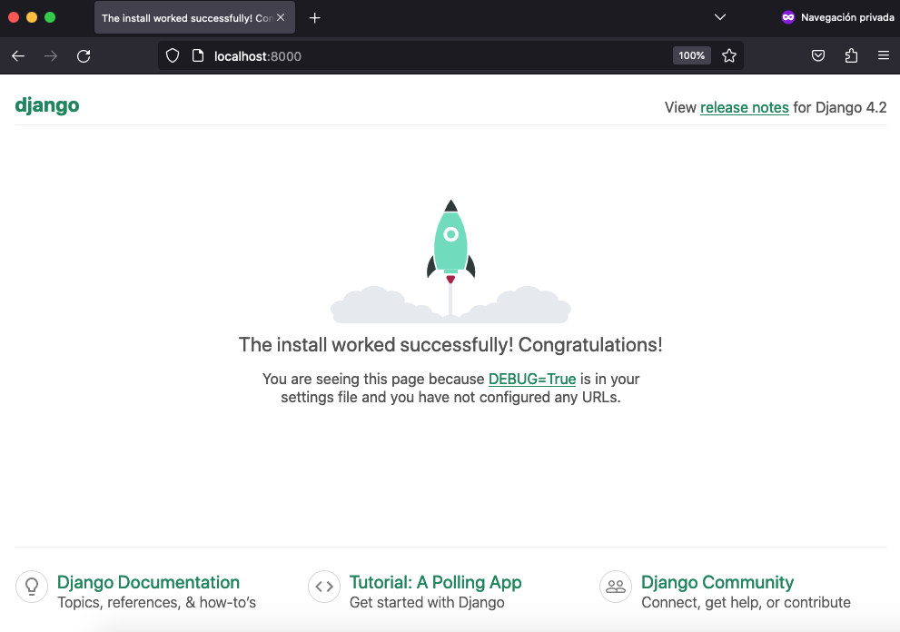
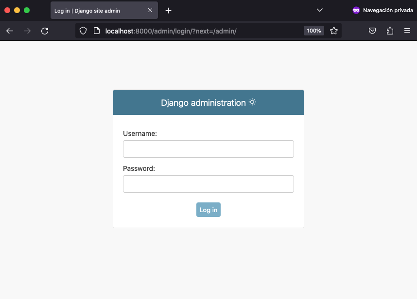

[](https://www.python.org/dev/peps/pep-0537/#schedule-first-bugfix-release)
[](https://www.djangoproject.com/)


[](LICENSE)

# TemplateDockerDjango
La plantilla de Docker y Django solo busca ser una guia para configurar el `volume` que ofrece Docker entre los archivos locales y el contedor. Esto con el fin de ir visualizando el contenido que se va generando en la máquina anfitriona (**host**) en la app de Django.



## Procedimiento

1. Clona el repo en local

    ```bash
    git clone https://github.com/HubertRonald/TemplateDockerDjango.git
    ```

2. Luego configura el entorno virtual
    ```bash
    python3 -m venv .venv                   # Instalar Entonorno Virtual
    . .venv/bin/activate                    # Activar Entorno Virtual
    python3 -m pip install --upgrade pip    # Actualizar el gestor de paquete pip
    pip install -r requirements.txt         # Instalar Bibliotecas de Python
    ```

3. No se ha subido al repo la app `tempdockerdjangoapp` porque esta es la que genera Django por defecto. En tal sentido sientete libre de removerla del .`gitignore`

4. Para lo anterior (`tempdockerdjangoapp`) se tomo lo siguiente en el archivo `.env`
    ```bash
    APP=tempdockerdjangoapp                         # Cambiar por SuApp
    DockerHOME="/home/TemplateDockerDjango/${APP}/" # Cambiar por SuDirectorioRaiz
    ImageName=temp_docker_django                    # Cambiar por SuNombreDeImagen
    ContainerName=docker_django_app                 # Cambiar por SuNombreDeContendor
    ```

> Nota: El archivo `.gitignore` tiene comentado `# .env` retirarle la almohadilla (`#`) cuando clones el proyecto, para que este no se suba a tu repositorio.

5. Para que las 4 variables: `APP`, `DockerHOME`, `ImageName` y `ContainerName`  queden disponibles, se ejecuta el ambiente con el siguiente comando:

    ```bash
    source .env
    ```

6. Hecho lo anterior se puede verificar que `echo $APP` imprimirá el valor definido en `.env`. Por tanto se puede iniciar la creación de la app con Django

    ```bash
    django-admin startproject $APP
    ```

7. Los siguientes comandos crean y levantan el servicio `db`. En la siguiente sección se dará un alcance sobre el `dockerFile` y el `docker-compose.yml`
    ```bash
    docker-compose build    # Crear el servicio
    docker-compose up -d    # Levantar el servicio
    ```

7. Abrir un navegador y colocar en la barra de navegación `localhost:8000`, se verá 

    

    Si se hace lo propio con `localhost:8000/admin` se verá la pantalla para loguearse

    

8. Apagar contenedor
    ```bash
    docker-compose down
    ```

10. Desactivar el entorno virtual
    ```bash
    deactivate
    ```

# DockerFile
Se crea apartir de la imagen `python:3.8`. Para pasar la variable de entorno `DockerHOME`, esta se define como argumento `ARG`, el cual será suministrado por docker-compose.yml cuando efectue el `build`.

Un detalle no menor es que primero se establece la capa para installar los paquetes con pip y por eso se copia primero el archivo requirements.txt y después viene la capa de copiar todo lo del directorio local al contedor, esto con el fin de que los scripts y demás elementos que son menos pesados que los paquetes (`bibliotecas`) no demoren el proceso de `build` con docker. 

# docker-compose.yml
Solo contiene un servicio `db` que toma como contexto el directorio actual para luego apuntar el Dockerfile que está en la carpeta `build`. Asimismo se configura el argumento a pasar al Dockerfile con la variable de ambiente `DockerHOME`. El nombre para la imagen y el contendor, también son tomados de las variables de ambiente, que también se declara en `env_file`.

Para los `volumes` se toma la app creada previamente con django (**paso 6**) en la máguina anfitriona (host) y se mapea con `:` hacia el **WorkDir** que se creo y definió con el archivo `DockerFile`.

# .dockerignore
Basicamente se define que archivos locales no deben ser incluidos mediante el `volume` configurado para el servicio `db` en el `docker-compose.yml`.


# .gitignore

Fue generado en [gitignore.io](https://www.toptal.com/developers/gitignore/) con los filtros `python`, `macos`, `windows` y consumido mediante su API como archivo crudo desde la terminal:

```bash
curl -L https://www.toptal.com/developers/gitignore/api/python,macos,windows > .gitignore
```

Tener presente que se desabilitó `# .env` remover la almohadilla (`#`). Asimismo la carpeta `tempdockerdjangoapp` fue incluida en este archivo porque este repositorio sólo tiene el proposito de ser una guía para la configuración del `volume`. Sientete libre de excluirlo también del .gitignore si lo consideras necesario.

# Autores

* **Hubert Ronald** - *Trabajo Inicial* - [HubertRonald](https://github.com/HubertRonald)

Ve también la lista de [contribuyentes](https://github.com/HubertRonald/TemplateDockerDjango/contributors) que participaron en este proyecto.


# Licencia

Este proyecto está bajo licencia MIT - ver la [LICENCIA](LICENSE) archivo (en inglés) para más detalle.